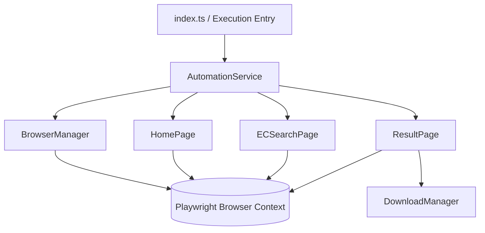
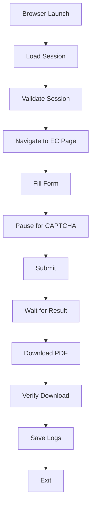

# Telangana Registration Portal Automation - Comprehensive Documentation

## Project Overview
This project provides an enterprise-grade automation framework to retrieve Encumbrance Certificates (EC) from the Telangana Registration Portal. The primary objective is to demonstrate a robust, maintainable, and scalable approach to interacting with complex government web portals. Rather than relying on fragile web-scraping techniques or circumventing security measures, this project embraces attended automation principles—establishing an authenticated session securely and orchestrating subsequent interactions programmatically.

## Key Features
- **Automated EC Retrieval Workflow:** Orchestrates form navigation, AJAX state waits, and PDF downloads.
- **Session Reuse After User Authentication:** Securely serializes and injects browser session states to seamlessly transition from manual authentication to headless automation.
- **Manual CAPTCHA Handling:** Intentionally pauses Node.js execution to allow manual resolution of CAPTCHAs, adhering to security boundaries.
- **Download Management:** Intercepts native browser download events, verifies file integrity, and routes files to designated storage.
- **Page Object Model (POM):** Encapsulates DOM interaction logic into modular, domain-specific classes.
- **TypeScript:** Enforces strict type safety across configurations and business logic.
- **Structured Logging:** Utilizes comprehensive logging for auditability and runtime debugging.
- **Error Handling:** Implements resilient wait conditions, explicit failure states, and DOM-aware timeouts.
- **Configurable Environment:** Centralized environment variable management for flexible deployments.
- **Maintainable Architecture:** Decouples core business logic from browser automation APIs.

## Architecture Overview
The system is built on a modular architecture separating orchestration, browser management, and page-specific interactions. By utilizing the Page Object Model (POM) pattern, the framework isolates brittle DOM selectors from the core business logic, ensuring high maintainability. Playwright was selected for its native support for browser contexts, robust asynchronous event handling, and native download interception. TypeScript ensures compile-time safety and self-documenting code.



## Complete Automation Workflow
The automation lifecycle is divided into session collection and headless execution.



## Folder Structure
```text
ts-registration-automation/
├── config/             # Environment configuration schemas
├── docs/               # Detailed architectural documentation
├── downloads/          # Target directory for retrieved EC documents
├── logs/               # Execution logs and error screenshots
├── src/
│   ├── browser/        # Playwright initialization and context management
│   ├── components/     # Reusable DOM abstractions (Dropdown, CaptchaHandler)
│   ├── pages/          # Page Object Models (HomePage, ECSearchPage, ResultPage)
│   ├── scripts/        # Standalone utilities (collect_session.ts)
│   ├── services/       # Core business logic and orchestration
│   ├── types/          # TypeScript interfaces and type definitions
│   ├── utils/          # Shared utilities (Constants, Logger, Selectors)
│   └── index.ts        # Main application entry point
├── .env.example        # Environment variable template
├── package.json        # Dependencies and NPM scripts
└── tsconfig.json       # TypeScript compiler configuration
```

## Configuration
The application relies on centralized configuration loaded from `.env` and validated at runtime.

| Variable | Description | Default | Example |
|----------|-------------|---------|---------|
| `DOWNLOAD_PATH` | Absolute or relative path to store PDFs. | `./downloads` | `C:/data/ecs` |
| `HEADLESS_MODE` | Boolean to run Playwright headlessly. | `false` | `true` |
| `LOG_LEVEL` | Verbosity of the application logs. | `info` | `debug` |

## Logging
The framework utilizes a structured logging strategy:
- **Console Logging:** Real-time feedback provided via `stdout` detailing current operational state.
- **File Logging:** Standardized logs are written to the `logs/` directory for historical auditing.
- **Timestamps:** Every log entry is prefixed with an ISO timestamp.
- **Error Logs:** Unhandled exceptions and assertion failures are logged with full stack traces. Error screenshots are automatically generated and saved.
- **Download Logs:** File ingestion operations, including destination paths and byte sizes, are explicitly logged.

## Error Handling
The framework is designed to fail gracefully:
- **Timeouts:** DOM queries utilize bounded timeouts. If an element fails to appear, a descriptive error is thrown rather than hanging indefinitely.
- **Network Failures:** Page navigations are wrapped in retry blocks to mitigate transient network instability.
- **Invalid Session:** If the injected session is rejected by the portal, the application halts execution and instructs the user to regenerate the session.
- **Download Failures:** Intercepted files are verified for size (greater than zero bytes). Corrupt downloads throw an explicit `DownloadError`.
- **Unexpected UI Changes:** Utilizing the POM pattern ensures that if selectors change, failures are localized to specific class methods.

## Security Considerations
- **No Authentication Bypass:** The automation strictly respects portal security by requiring the user to perform the initial authentication.
- **Session Reuse:** It reuses an authenticated browser session established by the user, mirroring standard enterprise RPA architectures.
- **Manual CAPTCHA Verification:** CAPTCHAs are intentionally solved manually to adhere to anti-bot guidelines.
- **Credential Security:** No hardcoded credentials exist within the source code.
- **Environment Isolation:** Sensitive deployment paths are managed strictly via environment variables.

## Assumptions
1. **User Supervision:** The system operates under an Attended Automation paradigm; a human operator is available to resolve CAPTCHAs.
2. **Session Validity:** Authenticated sessions have a sufficient lifespan to complete at least one end-to-end automation cycle.
3. **DOM Stability:** The portal's underlying HTML structure remains relatively stable between executions.
4. **Environment:** Node.js v16+ and Chromium are accessible in the deployment environment.

## Challenges Encountered
1. **Cross-Domain Navigation:** The portal separates authentication (`registration.telangana.gov.in`) and application logic (`tgigrs.telangana.gov.in`). Direct navigation across these boundaries results in unauthorized access. This was mitigated by routing execution through a gateway page that performs a native POST to bridge the domains securely.
2. **Dynamic Autocomplete Fields:** The SRO input relies on a jQuery UI autocomplete widget rather than a standard `<select>`. We engineered specific filler utilities to invoke the autocomplete dropdown and register the selection programmatically.
3. **Asynchronous PDF Generation:** The result page dynamically generates the PDF, causing unpredictable download initialization times. Playwright's native `waitForEvent('download')` was utilized to reliably intercept the stream regardless of latency.

## Engineering Decisions
- **Why Playwright?** Native browser context management, seamless download interception, and robust auto-waiting capabilities make it superior to Selenium for modern web applications.
- **Why Page Object Model (POM)?** Decouples fragile CSS/XPath selectors from business logic, dramatically reducing maintenance overhead when the portal UI changes.
- **Why Session Reuse?** Enables highly efficient batch processing while remaining compliant with portal security policies.
- **Why TypeScript?** Prevents runtime errors through strict typing of search criteria, configuration objects, and API responses.
- **Why Modular Utilities?** Ensures components like `Dropdown` or `CaptchaHandler` can be reused across entirely different government portals with minimal refactoring.
