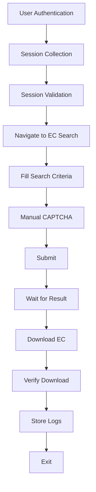

# Telangana Registration Portal – EC Automation

## Project Overview
This project provides an enterprise-grade automation framework designed to interact with the Telangana Registration Portal to retrieve Encumbrance Certificates (EC). The primary objective is to demonstrate a robust, maintainable, and scalable approach to interacting with complex, highly secured government web portals. Rather than relying on fragile web-scraping techniques, this project embraces an attended automation paradigm—establishing an authenticated session securely via human handover and orchestrating subsequent interactions programmatically.

## Features
- **Automated EC Retrieval Workflow:** Orchestrates form navigation, AJAX state waits, and PDF downloads.
- **Session Reuse After User Authentication:** Securely serializes and injects browser session states to seamlessly transition from manual authentication to headless execution.
- **Manual CAPTCHA Handoff:** Intentionally pauses Node.js execution to allow manual resolution of complex CAPTCHAs.
- **Download Management:** Intercepts native browser download events, verifies file integrity, and routes files to designated storage.
- **Page Object Model (POM) Architecture:** Encapsulates DOM interaction logic into modular, domain-specific classes.
- **Modular Project Structure:** Strictly separates business logic, configuration, and browser management.
- **Structured Logging:** Utilizes comprehensive persistent logging for auditability and runtime debugging.
- **Error Handling:** Implements resilient wait conditions, explicit failure states, and DOM-aware timeouts.
- **Configurable Environment:** Centralized environment variable management for flexible deployments.
- **Retry Mechanism:** Custom wrappers to retry transient network and DOM failures inherently common in government portals.
- **TypeScript Implementation:** Enforces strict type safety across configurations and business logic.
- **Playwright Browser Automation:** Leverages modern browser contexts for reliable execution.

## Technology Stack

| Technology | Purpose |
|------------|---------|
| **Node.js** | Runtime environment for executing the automation scripts. |
| **TypeScript** | Static typing to prevent runtime errors and ensure code maintainability. |
| **Playwright** | Core browser automation framework for context management and network interception. |
| **dotenv** | Environment variable management for configuration isolation. |
| **Winston** | Structured file and console logging for execution auditing. |
| **Zod** | Schema validation to ensure environment configurations meet expected formats before execution. |

## Project Architecture
The architecture is designed to prioritize maintainability and resilience against UI changes.
- **Why Playwright:** Native browser context management, seamless download interception, and robust auto-waiting capabilities make it superior to older frameworks for modern web applications.
- **Why TypeScript:** Prevents runtime errors through strict typing of search criteria, configuration objects, and API responses, reducing debugging time.
- **Why POM:** Decouples fragile CSS/XPath selectors from the core business logic. If the portal UI changes, modifications are localized to a single file.
- **Why Modular Utilities:** Ensures components like `Dropdown` or `CaptchaHandler` can be reused across entirely different portals with minimal refactoring.
- **Why Structured Logging:** File-based, timestamped logs (via Winston) are critical for auditing execution failures in headless production environments.

## Automation Workflow
The automation lifecycle is divided into session collection (Phase 1) and headless execution (Phase 2).



## Project Structure
```text
ts-registration-automation/
├── config/             # Environment configuration schemas and Zod validation
├── docs/               # Detailed architectural documentation
├── downloads/          # Target directory for retrieved EC documents
├── logs/               # Execution logs and error screenshots
├── src/
│   ├── browser/        # Playwright initialization and context management
│   ├── components/     # Reusable DOM abstractions (Dropdown, CaptchaHandler)
│   ├── pages/          # Page Object Models (HomePage, ECSearchPage, ResultPage)
│   ├── scripts/        # Standalone utilities (collect_session.ts)
│   ├── services/       # Core business logic and orchestration
│   ├── types/          # TypeScript interfaces and type definitions
│   ├── utils/          # Shared utilities (Constants, Logger, Selectors)
│   └── index.ts        # Main application entry point
├── .env.example        # Environment variable template
├── DOCUMENTATION.md    # Comprehensive project overview
├── package.json        # Dependencies and NPM scripts
└── tsconfig.json       # TypeScript compiler configuration
```

## Prerequisites
Ensure the following software is installed on your local machine:
- Node.js (v16.x or higher)
- npm (v8.x or higher)
- Playwright supported browsers (Chromium)

## Installation

1. **Clone the repository and install dependencies:**
   ```bash
   npm install
   ```

2. **Install Playwright Browsers:**
   ```bash
   npx playwright install chromium
   ```

## Configuration
The application relies on centralized configuration loaded from a `.env` file. Copy the provided example to get started:

```bash
cp .env.example .env
```

### Environment Variables
| Variable | Description | Default | Example |
|----------|-------------|---------|---------|
| `DOWNLOAD_PATH` | Absolute or relative path to store downloaded PDFs. | `./downloads` | `C:/data/ecs` |
| `HEADLESS_MODE` | Boolean flag to run Playwright headlessly. | `false` | `true` |
| `LOG_LEVEL` | Verbosity of the application logs. | `info` | `debug` |

## Running the Project

### Step 1: Session Collection
Prior to automated execution, an authenticated session must be established.
```bash
npm run collect
```
*Expected Behavior:* The script launches a Chromium browser. The user manually logs in, solves the initial CAPTCHA, and presses ENTER in the terminal. The authenticated session cookies are serialized to `session.json`.

### Step 2: Automation Execution
Once the session is serialized, the core automation can be executed. Edit `src/index.ts` to supply your desired search criteria, then run:
```bash
npm run dev
```
*Expected Behavior:* The script injects the session, navigates across domains seamlessly without hitting the login wall, fills the search criteria, pauses for the secondary CAPTCHA, and downloads the document to the `downloads/` directory.

## Logging
The framework utilizes a structured logging strategy implemented via Winston:
- **Console Logs:** Real-time feedback provided via `stdout` detailing the current operational state.
- **File Logs:** Standardized logs are written to the `logs/` directory for historical auditing.
- **Timestamps:** Every log entry is prefixed with an ISO timestamp.
- **Error Logs:** Unhandled exceptions and assertion failures are logged with full stack traces.
- **Screenshots:** If the automation fails unexpectedly, an error screenshot is automatically generated and saved to the `logs/` directory for post-mortem analysis.

## Error Handling
The framework is designed to fail gracefully and recover where possible:
- **Timeouts:** DOM queries utilize bounded timeouts. If an element fails to appear, a descriptive error is thrown rather than hanging indefinitely.
- **Network Failures:** Page navigations are wrapped in retry blocks to mitigate transient network instability.
- **Invalid Session:** If the injected session is rejected by the portal, the application halts execution and instructs the user to regenerate the session.
- **Missing Elements:** Utilizing the POM pattern ensures that if selectors change, failures are caught explicitly before continuing execution.
- **Download Verification:** Intercepted files are verified for size (greater than zero bytes). Corrupt downloads throw an explicit `DownloadError`.
- **Retry Logic:** Non-fatal operations utilize a generic `Retry` utility to automatically attempt the action multiple times before yielding an error.

## Security Considerations
- **No Authentication Bypass:** The automation strictly respects portal security by requiring the user to perform the initial authentication.
- **Session Reuse:** The automation reuses an authenticated browser session established by the user, mirroring standard enterprise RPA architectures.
- **Manual CAPTCHA Verification:** CAPTCHAs are intentionally solved manually to adhere to anti-bot guidelines and prevent reliance on noisy OCR libraries.
- **Credential Security:** No hardcoded credentials exist within the source code.
- **Environment Isolation:** Sensitive deployment paths and operational flags are managed strictly via environment variables.

## Engineering Decisions
- **Why session reuse:** Enables highly efficient batch processing of documents while remaining compliant with portal security policies, avoiding the need for credentials in code.
- **Why manual CAPTCHA:** Relying on OCR for complex government CAPTCHAs introduces unacceptable failure rates in production. Manual handoff ensures 100% accuracy at the authorization gate.
- **Why Playwright:** Provides native download interception and browser context injection, removing the need for third-party HTTP proxy workarounds.
- **Why POM:** Decouples the brittle UI layer from the robust business logic layer, making maintenance highly predictable.
- **Why retries:** Government portals frequently experience high latency; wrapping actions in retries prevents localized latency spikes from terminating the entire workflow.
- **Why modular architecture:** By strictly separating concerns, the underlying components (`BrowserManager`, `DownloadService`) can be reused across entirely different automation projects.

## Known Limitations
- **Session Expiration:** The `session.json` cookies are subject to the server's natural expiration policy. The user must manually run the collector once the session expires.
- **Manual CAPTCHA:** Because CAPTCHAs are not bypassed, the script cannot run 100% headlessly in continuous integration without a human operator present during the execution phase.
- **Portal UI Changes:** As with all DOM-based automation, if the Telangana portal completely rewrites its frontend HTML IDs or classes, `Selectors.ts` must be updated.
- **Government Portal Availability:** The automation is entirely dependent on the uptime and performance of the upstream government servers.

## Future Improvements
To scale this architecture for high-throughput production environments, the following enhancements are planned:
- **Docker Integration:** Containerize the Node.js application alongside the Playwright Chromium binaries to ensure environmental parity across deployment clusters.
- **CSV & Excel Support:** Develop utility parsers to map hundreds of document parameters from `.csv` or `.xlsx` files to the `ECSearchCriteria` interfaces for bulk execution.
- **Batch Execution:** Refactor to process multiple documents within a single authenticated session loop.
- **REST API Wrapper:** Expose the automation services via an Express.js server, allowing external enterprise systems to trigger EC retrievals synchronously or asynchronously via JSON payloads.
- **Parallel Processing:** Refactor the `BrowserManager` to support multiple isolated `BrowserContexts` concurrently.
- **Automatic Session Refresh:** Implement daemon processes that periodically ping the portal to prevent session timeouts.
- **Monitoring & Metrics:** Emit application metrics to a centralized database (Prometheus) and visualize automation health via real-time Grafana dashboards.
- **CI/CD Integration:** Implement GitHub Actions pipelines to enforce strict ESLint standards and run unit tests.
- **Cloud Deployment:** Deploy the containerized application to scalable orchestration services (AWS ECS or Google Cloud Run).

## Documentation
For a deeper dive into the engineering methodology and architecture, please refer to the supplementary documentation:
- [DOCUMENTATION.md](./DOCUMENTATION.md) - Comprehensive project overview.
- [docs/Architecture.md](./docs/Architecture.md) - System architecture and dependency flow.
- [docs/Approach.md](./docs/Approach.md) - Portal analysis and strategy design.
- [docs/Challenges.md](./docs/Challenges.md) - Technical hurdles and resolutions.
- [docs/FutureImprovements.md](./docs/FutureImprovements.md) - Scaling and deployment strategies.

## License
This project was developed solely for internship evaluation and technical demonstration purposes. No commercial license is provided.
