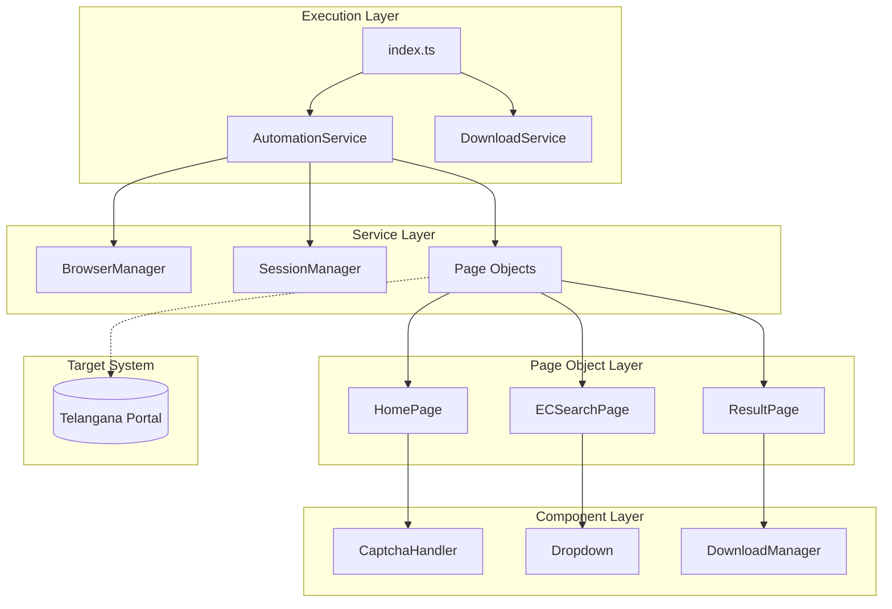
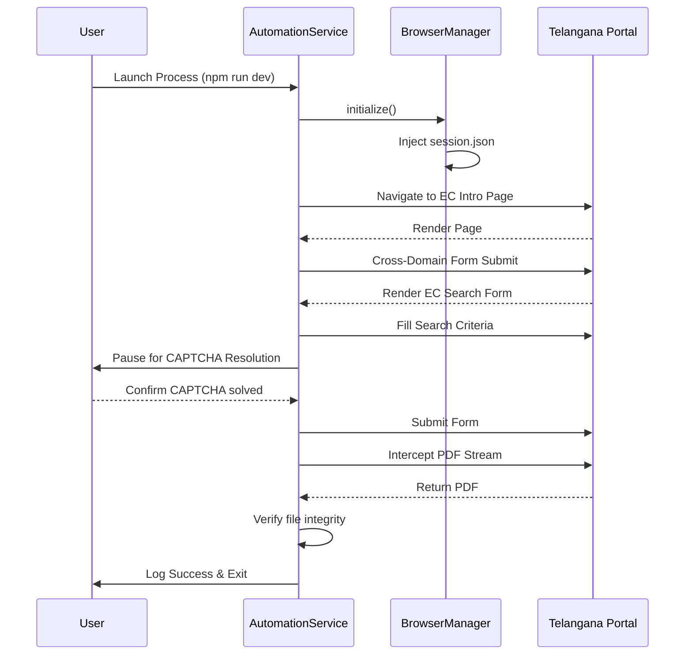

# System Architecture

## High-Level Architecture
This automation framework is designed to strictly separate business logic, DOM orchestration, and session state. Built upon Node.js and Playwright, the system is fundamentally an orchestrator that interacts with the Telangana Registration Portal just as a human operator would, utilizing an Attended Automation paradigm.

## Layered Design & Responsibilities

### 1. Execution Layer
- **Responsibility:** Ingests external triggers (CLI, cron, or eventually HTTP requests), constructs configuration models, and initializes the high-level services.
- **Key Components:** `index.ts`, `collect_session.ts`.

### 2. Service Layer
- **Responsibility:** Orchestrates the multi-step business process (e.g., "Retrieve EC"). It dictates *what* needs to be done, while delegating the *how* to the Page Object layer.
- **Key Components:** `AutomationService.ts`, `DownloadService.ts`.

### 3. Page Object Layer
- **Responsibility:** Encapsulates all DOM interactions, locators, and UI state validations for specific portal screens.
- **Key Components:** `HomePage.ts`, `ECSearchPage.ts`, `ResultPage.ts`.

### 4. Component / Utility Layer
- **Responsibility:** Provides abstract, highly reusable DOM interactions and operational utilities that are agnostic to any specific page.
- **Key Components:** `Dropdown.ts`, `CaptchaHandler.ts`, `Retry.ts`, `Logger.ts`.

## Dependency Flow
Dependencies flow strictly downward. The Execution Layer depends on the Service Layer. The Service Layer depends on the Page Object Layer. The Page Object Layer depends on the Component Layer and Playwright APIs.
This unidirectional flow prevents circular dependencies and ensures that UI changes in the target portal only require modifications at the lowest architectural level (Page Objects).

## Execution Lifecycle

